# 📘 Database Server (CentOS 7.9.2207~)

## 📌 DB 서버 기본 작업 정리

### 🔸 개요
- 별도의 환경설정 파일이 필요 없고 사용자가 모든 설정을 해야 한다.
- 웹과 연동되기 때문에 **Web Server**, **FTP Server**와 함께 운영한다.

---

## 📚 DB Server에서의 필수 내용

### 🧩 주요 용어의 범위
- **Database (데이터베이스)** → **Table (테이블)** → **Field (필드, 칼럼)** → **Value (값)**

---

### 🔑 필수적인 10가지 명령어

#### ✔ 주 명령어
- `Create`, `Drop`, `Delete`, `Insert`, `Update`, `Alter`, `Select`

#### ✔ 보조 명령어
- `Show`, `Use`, `Desc`

> 💡 **모든 명령어 뒤에는 반드시 `;`(세미콜론)를 입력해야 한다.**

---

## ⚙️ 기본 작업

- **패키지**: `mariadb-*`  
- **포트**: `3306/TCP`  
- **서비스**: `mysql`  
- **데몬**: `mariadb[.service]`

### ✅ 설치 명령어
---
yum -y install mariadb-*
---

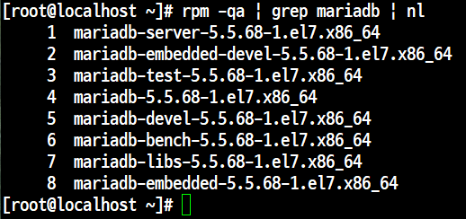

---

## 🔥 방화벽 설정

### 명령어로 포트/서비스 추가
```
firewall-cmd --list-all

firewall-cmd --permanent --add-port=3306/tcp
firewall-cmd --permanent --add-service=mysql

firewall-cmd --reload
```

### 파일 편집으로 추가
---
vi /etc/firewalld/zones/public.xml
---

### 서비스 재시작
---
systemctl restart mariadb
---

---

## 🛠️ 보조 명령어

###  **show**
- **개요**: 데이터베이스와 테이블의 목록을 확인한다.


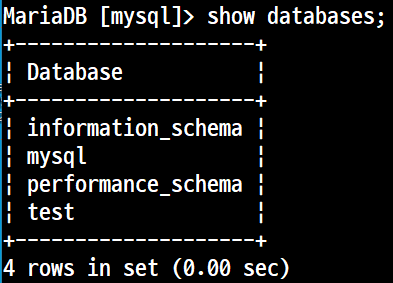
```
show databases;
```


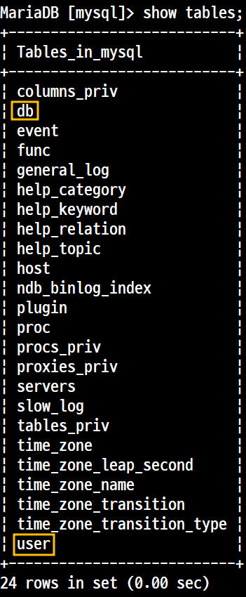
```
show tables;
```

> `user` 테이블 → 사용자 정보  
> `db` 테이블 → 사용자와 DB 연결

---

##  **use**
- **개요**: 사용하고 있는 데이터베이스를 변경할 때 사용

- **문법**:
---
use <database명>;
---

- **예시**:
```
MariaDB [mysql]> use test;
Database changed

MariaDB [test]> show tables;
Empty set (0.00 sec)

MariaDB [test]> use mysql;
Database changed
```

---

### 🧾 desc / describe / explain
- **개요**: 테이블의 필드 타입을 확인할 때 사용

- **문법**:
```
desc <table명>;
describe <table명>;
explain <table명>;
```

### 🛠️ 주 명령어
---

## **create**
**개요**  
    → 데이터베이스와 테이블을 생성할 때 사용한다.

**문법**
- 데이터베이스 생성
```
create database <DATABASE명>;
```
- 테이블 생성
```
create table <DATABASE명>;
```
---
create table <TABLE명> (<필드1> <타입1>, <필드2> <타입2>, …);

- **실습**

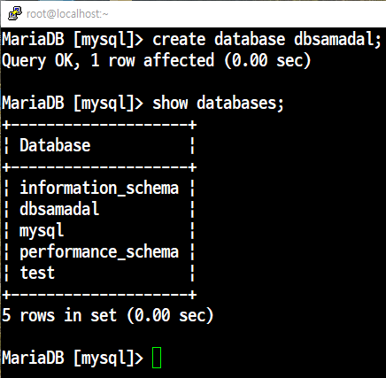
```
show databases;
``` 
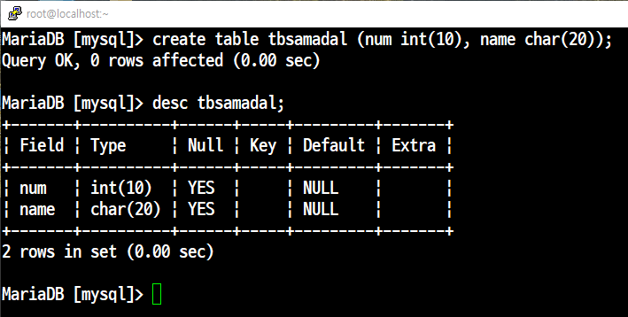

---
## **drop**
**개요**  
데이터베이스와 테이블을 삭제할 때 사용한다.

**문법**<br>
`데이터베이스 삭제`<br>
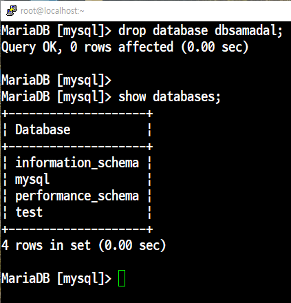

```
drop database <DATABASE명>;
```
`테이블 삭제`<br>
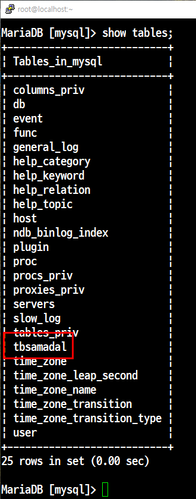

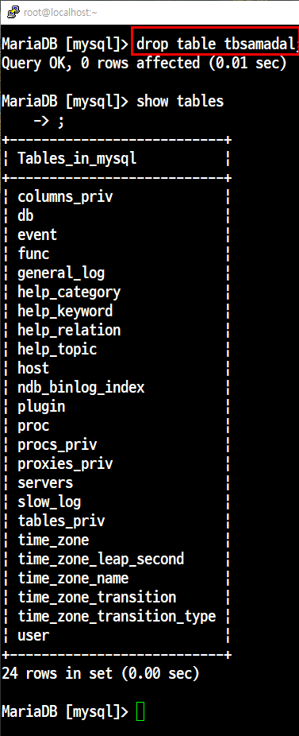

```
drop table <TABLE명>;
```
---
## **select**
**개요**  
테이블 안에 있는 필드의 값을 확인할 때 사용한다.

**문법**
특정 필드 조회<br>
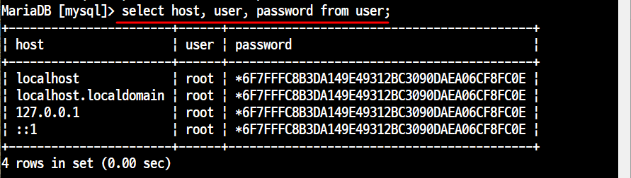

```
select <FIELD명1>, <FIELD명2> from <TABLE명>;
```
전체 조회<br>
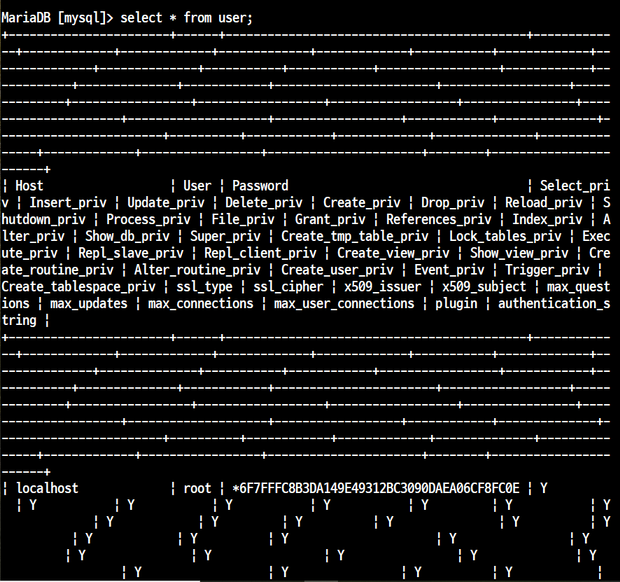
```
select * from <TABLE명>;
```
## **update**
**개요**  
→ 테이블 안에 있는 필드의 내용(값)을 갱신할 때 사용한다.  
→ ‘password’ 필드의 경우 반드시 `password()` 함수 형태로 값을 받아와야 한다.

**문법**<br>
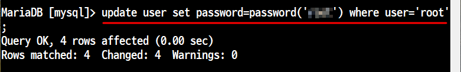
```
update <TABLE명> set <FIELD명1>=<값1>, <FIELD명2>=<값2>, … where <조건>;
```

---

## **delete**
**개요**  
→ 테이블 안에 있는 필드의 내용(값)을 삭제할 때 사용한다.

**문법**<br>

```
delete from <TABLE명> where <조건>;
```
---

## **insert**
**개요**  
→ 테이블 안에 있는 필드의 내용(값)을 입력(삽입, 생성)할 때 사용한다.

**문법**
- 필드의 갯수와 값의 갯수가 동일할 때
```
insert into <TABLE명> (FIELD1, FIELD2, …) values (VALUE1, VALUE2, …);
```

- 테이블의 모든 필드 값을 함께 입력할 때
```
insert into <TABLE명> values (VALUE1, VALUE2, …);
```


---


