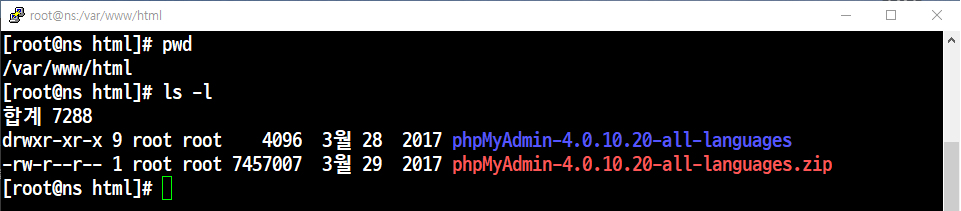
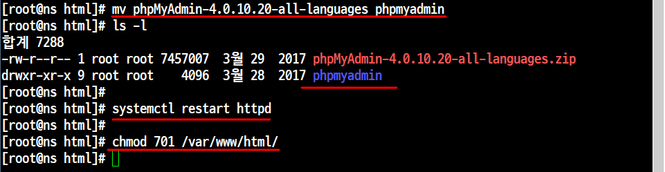
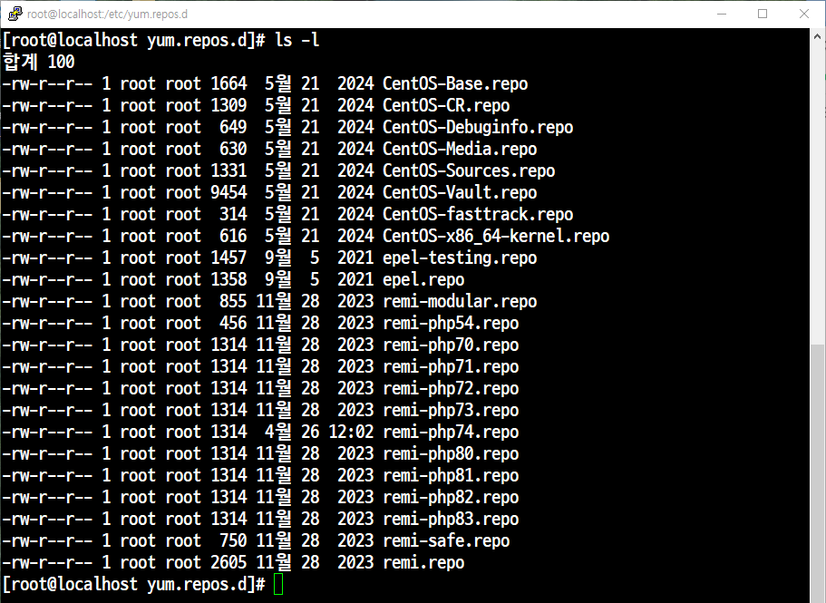
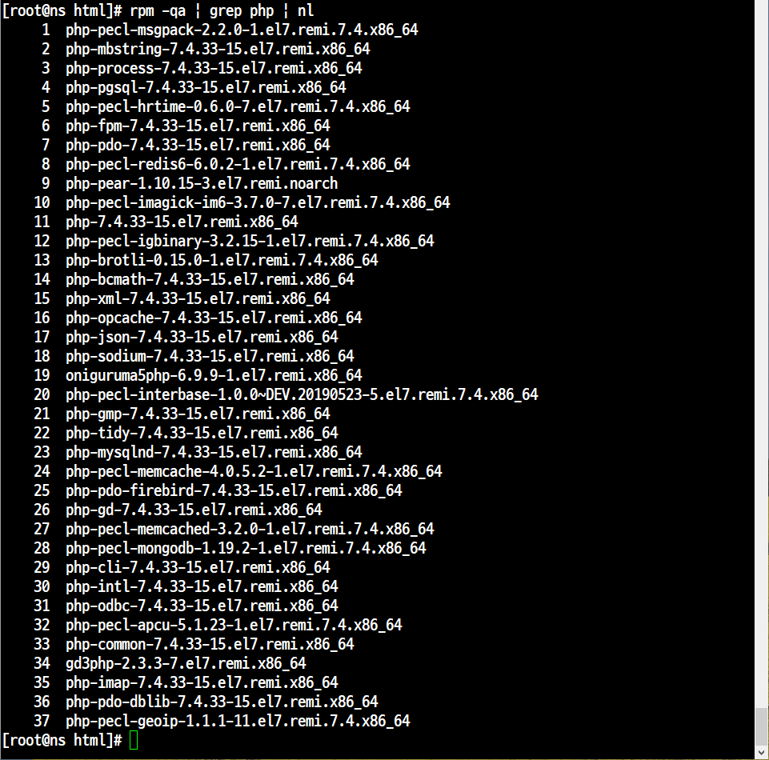
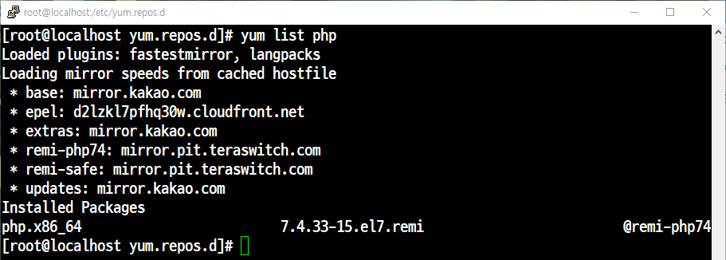
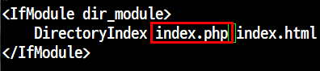
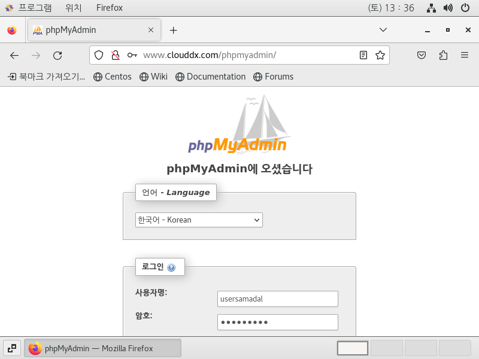
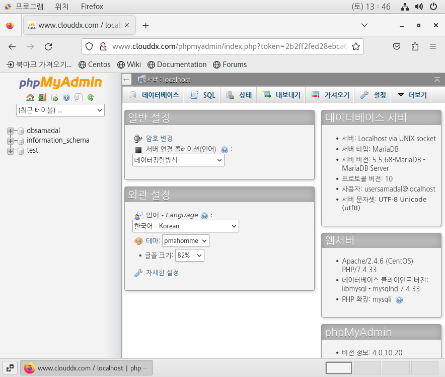

# 📘 phpmyadmin

dns서버에 이어서 phpmyadmin을 실습

아파치 기본 폴더`(/var/www/html/)`에 `phpmyadmin`을 다운로드
```
wget https://files.phpmyadmin.net/phpMyAdmin/4.0.10.20/phpMyAdmin-4.0.10.20-all-languages.zip

```
그리고 파일압축을 푼다.
```
unzip phpMyAdmin-4.0.10.20-all-languages.zip
```
---
- 압축파일 확인


---
- 이름을 변경해주고, 데몬 재실행과 허가권을 변경해준다.


---

## phpmyadmin 웹 사이트 출력
```
yum install php-*
yum install php-* --skip-broken
```


## 저장소 설치

```

[root@localhost /]# yum -y install https://rpms.remirepo.net/enterprise/remi-release-7.rpm
[root@localhost /]# yum -y install epel-release yum-utils
```
---
- 저장소 확인

---

## remi-php74 활성화
```
yum-config-manager --enable remi-php74
```

```
yum -y install php #php 설치

yum -y install php-fpm #php 관련 기타 패키지 설치 
```

```
yum -y install php-cli  php-redis  php-brotli php-intl php-gd php-gmp php-imap php-bcmath php-interbase php-json php-mbstring

yum -y install php-mysqlnd php-odbc php-opcache php-memcached php-tidy php-pdo php-pdo-dblib php-pear php-pgsql php-process

yum -y install php-pecl-apcu php-pecl-geoip php-pecl-imagick php-pecl-hrtime php-pecl-json php-pecl-memcache php-pecl-mongodb

yum -y install php-pecl-rar php-pecl-pq php-pecl-redis4 php-pecl-yaml php-pecl-zip
```


- 패키지 확인

```
rpm -qa | grep php | nl
```

- 버전 확인


---
## php 패키지 동작 상태 확인

→ 설치한 php 패키지가 정상 동작하는지 파일을 생성해서 확인

→ 파일 생성     → vi phpinfo.php
```
<?php
        phpinfo();
?>
```


```
vi /etc/httpd/conf/httpd.conf
```
먼저 index.php 파일을 찾고,

없으면 index.html 파일을 찾아서,

그 파일을 자동으로 표시합니다.

## 데몬 실행
```
systemctl restart httpd
```

## 완료


---

