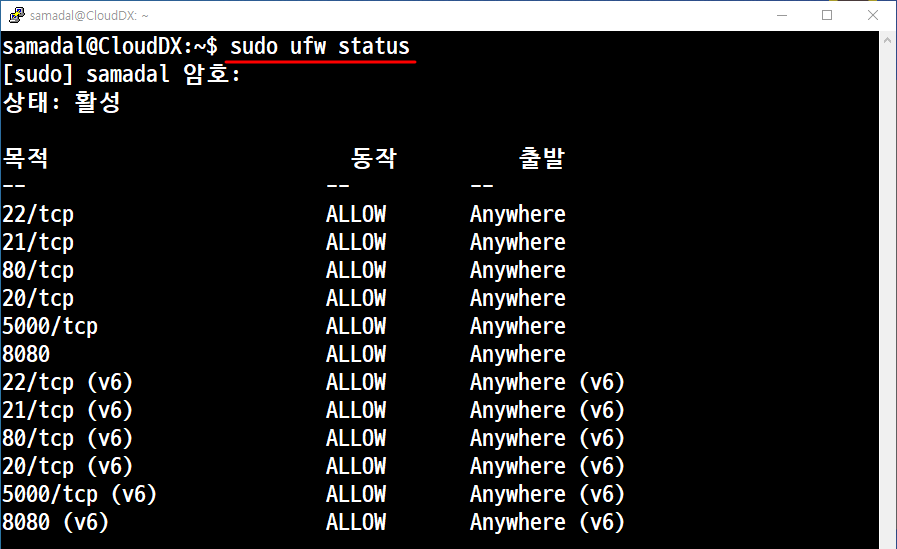
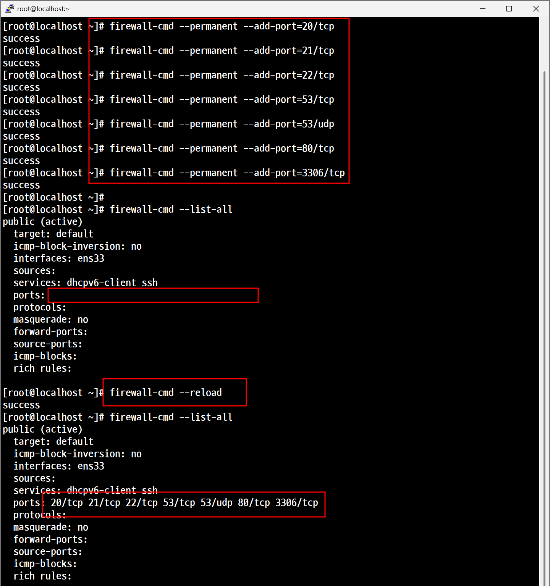

## 🔥 방화벽 설정 (Ubuntu vs CentOS)

### 📌 Ubuntu - `ufw` (Uncomplicated Firewall)

| 작업 내용       | 명령어 예시                     |
|----------------|----------------------------------|
| 방화벽 상태 확인 | `sudo ufw status`                |
| 방화벽 활성화    | `sudo ufw enable`                |
| 방화벽 비활성화  | `sudo ufw disable`               |
| 포트 열기        | `sudo ufw allow 22`              |
| 포트 닫기        | `sudo ufw deny 22`               |
| 포트 삭제        | `sudo ufw delete allow 22`       |

- **기본 포트 22**는 SSH 접속용 포트
- `ufw`가 설치 안 되어 있다면:  
  `sudo apt install ufw`

---

### 📌 CentOS - `firewalld`

| 작업 내용         | 명령어 예시                                            |
|------------------|---------------------------------------------------------|
| 서비스 상태 확인  | `sudo systemctl status firewalld`                      |
| 방화벽 시작       | `sudo systemctl start firewalld`                       |
| 방화벽 중지       | `sudo systemctl stop firewalld`                        |
| 포트 열기         | `sudo firewall-cmd --add-port=22/tcp --permanent`     |
| 포트 닫기         | `sudo firewall-cmd --remove-port=22/tcp --permanent`  |
| 설정 적용         | `sudo firewall-cmd --reload`                           |
| 열려 있는 포트 확인| `sudo firewall-cmd --list-all`                         |

- `--permanent` 옵션은 **재부팅 후에도 유지됨**
- `--reload` 명령어로 **적용 필수**

---

## 💡 요약 비교

| 구분       | Ubuntu (ufw)           | CentOS (firewalld)                    |
|------------|-------------------------|----------------------------------------|
| 기본 상태  | 비활성화                | 활성화                                 |
| 포트 추가  | `ufw allow [포트]`      | `firewall-cmd --add-port=[포트]/tcp`   |
| 포트 삭제  | `ufw delete allow [포트]` | `firewall-cmd --remove-port=[포트]/tcp`|
| 상태 확인  | `ufw status`            | `firewall-cmd --list-all`             |
