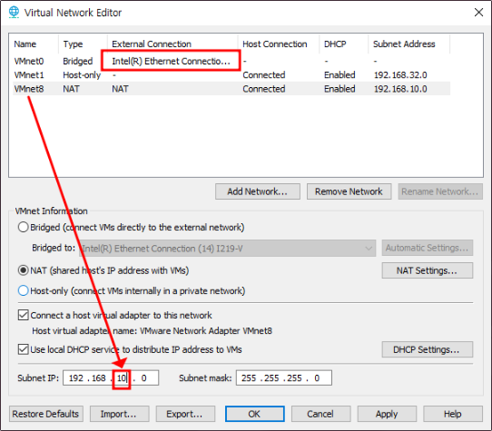
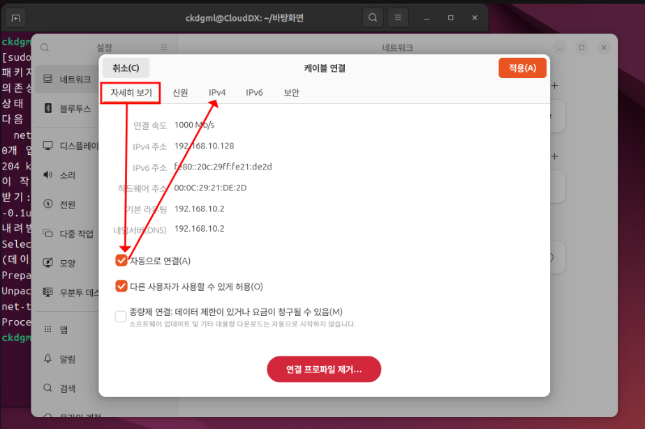
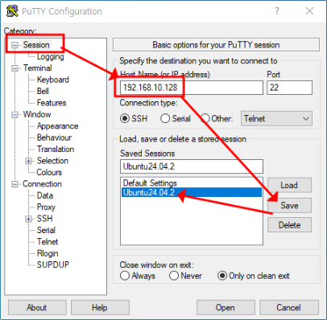
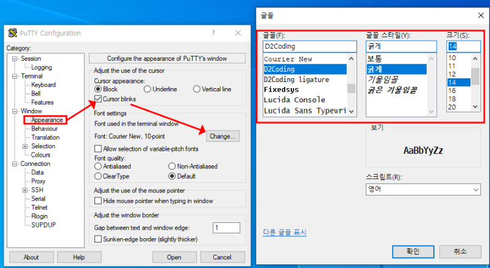
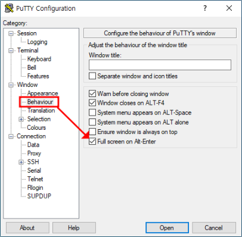
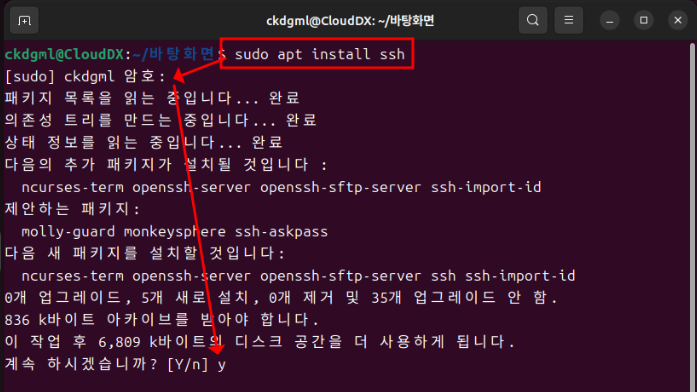

# 원격 접속

### 📌 개요: 왜 원격 접속이 필요한가?

- 리눅스와 유닉스는 기본적으로 **GUI가 아닌 CLI(명령어 기반 인터페이스)** 를 사용해 운영됩니다.
- 서버 운영 및 관리는 대부분 **직접 명령어를 입력하여 수행**하게 됩니다.

- 모든 서버가 눈앞에 있는 것은 아닙니다. 대부분의 서버는 **IDC(Internet Data Center)** 혹은 웹호스팅 업체에 위치해 있으며, 물리적으로 떨어진 장소에 존재합니다.
- 이러한 서버를 관리하기 위해 **직접 방문**하여 작업하기란 **비효율적**이고 **현실적으로 어렵습니다.**

✅ 따라서 **원격 접속을 통한 서버 관리**는  
리눅스/유닉스 시스템 운영에서 **필수적인 요소**입니다.

### 1. 접속을 위한 설정



> 수동 IP를 잡기 위한 작업입니다.

---

### 2. 리눅스 IP 확인 및 설정



<br>


설정 완료 후 아래 명령어를 사용해 IP 확인:

```
sudo apt install net-tools 
ifconfig
```

### 3. PuTTY로 원격 리눅스 서버 접속



<br>



<br>



---

### 4. Ubuntu에 패키지 설치 및 SSH 데몬 실행



```bash
sudo apt update
sudo apt upgrade
sudo apt install ssh
```

> ✅ **SSH (Secure Shell)**는 원격 접속을 위한 **보안 프로토콜**이며,  
> 기본적으로 **포트 22번**을 사용합니다.  
> SSH를 통해 터미널 환경에서 **원격 서버를 안전하게 제어**할 수 있습니다.
